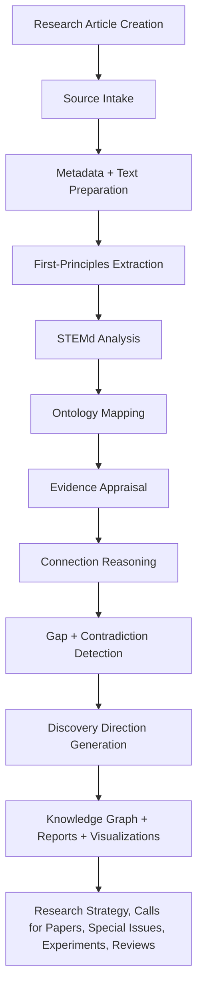

# AtlasX Discovery Layer

[](#project-status-experimental-research-infrastructure)
[](pyproject.toml)
[](LICENSE)

**First-principles, multi-agent research sensemaking for turning papers into
knowledge atoms, connections, gaps, and discovery directions.**

Traditional research databases retrieve papers. AtlasX extracts the principles
inside papers and reasons upward toward discovery.

Google Scholar finds papers. A database stores papers. A literature review
summarizes papers. AtlasX extracts questions, variables, mechanisms, claims,
evidence, gaps, contradictions, and next-step discovery directions from papers.

## Project Status: Experimental Research Infrastructure

AtlasX is not medical, legal, or scientific final advice. Outputs are
research-support artifacts. They require human review and expert validation.
They should not be used as clinical advice, legal advice, final scientific
conclusions, or automated editorial decisions.

## Why This Matters

Modern research does not only suffer from lack of access. It suffers from too
much information, too little synthesis, inconsistent terminology, too many
disconnected concepts, and too much cognitive burden on researchers. AtlasX is
designed to help users move from a pile of papers to a map of meaning.

## What the Discovery Layer Is

AtlasX treats the fundamental claim, mechanism, variable, question, and evidence
unit as the smallest unit of research meaning. It does not stop at paper-level
summary. It breaks papers into knowledge atoms, preserves uncertainty, and then
connects atoms through mechanisms, variables, evidence structures, gaps, and
field-level questions.

A shallow system might say two papers are related because both mention cancer
cells. AtlasX aims to ask whether the papers touch the same exposure, membrane
state, cell line, mechanism, evidence type, unanswered biological question, or
replication need.

## Where AtlasX Fits in the Data Life Cycle

Most research databases stop at storage, indexing, retrieval, and presentation.
AtlasX adds a post-publication sensemaking layer. It sits between stored
articles and final research strategy. Its job is to convert papers into
structured knowledge atoms, map relationships, identify evidence patterns,
reveal gaps and contradictions, and suggest responsible next steps.



## Installation

```bash
git clone https://github.com/YOUR-ORG/atlasx-discovery-layer.git
cd atlasx-discovery-layer
python -m venv .venv
source .venv/bin/activate
pip install -e ".[dev,pdf]"
```

On Windows PowerShell:

```powershell
git clone https://github.com/YOUR-ORG/atlasx-discovery-layer.git
cd atlasx-discovery-layer
python -m venv .venv
.\.venv\Scripts\Activate.ps1
pip install -e ".[dev,pdf]"
```

## Quickstart

Run the deterministic offline demo without an API key:

```bash
atlasx run --project examples/sample_project --provider offline
atlasx graph --project examples/sample_project
atlasx report --project examples/sample_project
```

Outputs are written to `examples/sample_project/outputs/`.

## Running Locally With a Local LLM

AtlasX supports OpenAI-compatible local endpoints, including Ollama, LM Studio,
vLLM, and LocalAI.

```bash
cp .env.example .env
export LOCAL_LLM_BASE_URL=http://localhost:11434/v1
export LOCAL_LLM_MODEL=llama3.1
atlasx run --project examples/sample_project --provider local --model llama3.1
```

Windows PowerShell:

```powershell
Copy-Item .env.example .env
$env:LOCAL_LLM_BASE_URL = "http://localhost:11434/v1"
$env:LOCAL_LLM_MODEL = "llama3.1"
atlasx run --project examples/sample_project --provider local --model llama3.1
```

## Running With OpenAI

```bash
cp .env.example .env
export OPENAI_API_KEY=your_key_here
atlasx run --project examples/sample_project --provider openai --model gpt-4.1-mini
```

Never hard-code secrets or commit `.env`.

## Using Your Own Papers

Create a project folder:

```bash
atlasx init --project my_research_project
```

Place lawful text files in `my_research_project/papers/`, then edit
`my_research_project/source_manifest.yaml` with citation metadata, DOI, title,
authors, year, journal, source type, and tags. AtlasX can process `.txt`, `.md`,
and optionally `.pdf` when the PDF dependency is installed.

If a field cannot be extracted, AtlasX should write `unknown` or `not reported`
rather than inventing an answer.

## Agent Team

AtlasX uses modular agents. Each agent has a reusable prompt in
`prompts/agents/` and a Python class in `src/atlasx/agents/`.

1. Intake Agent identifies files and citation metadata.
2. Source Integrity Agent checks provenance, duplicates, and access warnings.
3. Text Preparation Agent creates clean chunks with traceable locations.
4. First-Principles Extraction Agent creates knowledge atoms.
5. STEMd Analysis Agent evaluates Specificity, Translatability, Evidence,
   Mechanism/Systems, and Discovery Direction.
6. Ontology Mapping Agent maps terms to concepts without collapsing uncertainty.
7. Evidence Appraisal Agent assesses evidence type, limitations, and confidence.
8. Connection Reasoning Agent connects papers through mechanisms, variables,
   methods, outcomes, gaps, and contradictions.
9. Gap and Contradiction Agent identifies missing variables and unresolved areas.
10. Discovery Direction Agent proposes responsible next research steps.
11. Visualization and Reporting Agent writes JSON, CSV, and Markdown outputs.
12. Bias and Ethics Review Agent checks overclaiming, citation bias, paywall
    bias, prestige bias, and missing source traces.

## How STEMd Is Used

STEMd is a sensemaking framework:

- **Specificity:** What exact topic, population, method, variable, exposure,
  intervention, or research question is being studied?
- **Translatability:** What does the finding mean for researchers,
  institutions, editors, practitioners, or future studies?
- **Evidence:** How strong, consistent, or limited is the evidence?
- **Mechanism/Systems:** What process may explain the finding?
- **Discovery Direction:** What gap, contradiction, connection, replication
  need, or future opportunity does the study reveal?

## Outputs

AtlasX writes:

- `outputs/extractions/{paper_id}.json`
- `outputs/stemd/{paper_id}_stemd.json`
- `outputs/graph/nodes.csv`
- `outputs/graph/edges.csv`
- `outputs/reports/discovery_report.md`
- `outputs/reports/executive_summary.md`
- `outputs/audit/agent_runs.jsonl`

Researchers and editors can use these outputs to plan review articles, solicit
future research, identify candidate special issues, compare studies, identify
replication needs, and reduce information overload.

## Using AtlasX With Paywalled or Licensed Sources

- Do not commit copyrighted PDFs to a public repository.
- Use local folders ignored by Git for private source files.
- AtlasX can store citation metadata and extracted knowledge atoms.
- Preserve links and DOIs for verification.
- Do not use extraction to misrepresent or replace the original source.
- Follow your institution's license terms.

## Bias, Hallucination, and Provenance Safeguards

AtlasX should:

- Preserve uncertainty and source traces.
- Distinguish what the paper directly says from agent inference.
- Mark claims that require human review.
- Avoid ranking researchers unfairly.
- Avoid overvaluing famous journals or highly cited work only.
- Flag missing citation fields and paywall barriers.
- Require expert review before decisions.

## Roadmap

- Add richer PDF section and page tracing.
- Add optional interactive graph visualization.
- Add JSON-LD and RDF exports.
- Add domain-specific ontology adapters.
- Add benchmark fixtures for extraction quality.
- Add connector examples for institutional repositories.

## How to Cite

If you use AtlasX, cite the repository and version:

```text
AtlasX Discovery Layer contributors. AtlasX Discovery Layer: First-principles,
multi-agent research sensemaking for papers. Version 0.1.0.
```

## Human Review Required

AtlasX can reduce cognitive load, but it cannot replace expert interpretation,
peer review, source reading, or ethical judgment.

