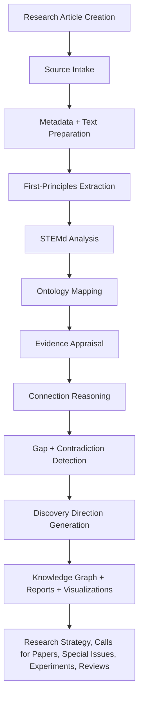

# Where AtlasX Fits in the Research Data Life Cycle

Most research databases stop at storage, indexing, retrieval, and presentation.
AtlasX adds a post-publication sensemaking layer. It sits between stored
articles and final research strategy. Its job is to convert papers into
structured knowledge atoms, map relationships, identify evidence patterns,
reveal gaps and contradictions, and suggest responsible next steps.

AtlasX is designed for the phase where a user already has citations, full text,
abstracts, or lawful notes and needs structured meaning rather than another list
of search results.

## Inputs

- Citation metadata in `source_manifest.yaml`.
- Lawfully supplied `.txt`, `.md`, or optional `.pdf` source files.
- User notes, abstracts, or institutional summaries when full text cannot be
  used.

## Sensemaking Outputs

- Knowledge atoms.
- STEMd analysis.
- Evidence appraisals.
- Concept mappings.
- Gap and contradiction records.
- Discovery directions.
- Knowledge graph CSV files.
- Markdown reports for human review.

## Decision Support

AtlasX outputs can support review planning, special issue scoping, calls for
papers, replication planning, and research strategy. They do not replace expert
reading, peer review, or domain judgment.

